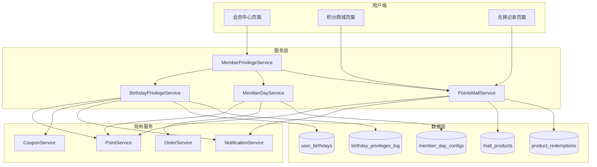
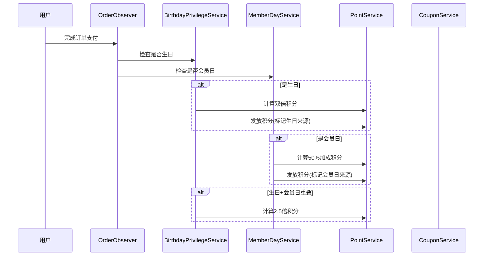

# Design Document: 会员权益升级

## Overview

本设计文档描述火锅店小程序会员权益升级功能的技术实现方案，包括生日特权、会员日活动和积分商城丰富化三大模块。该功能将与现有的积分系统、优惠券系统和订单系统深度集成，通过事件驱动架构实现自动化的权益发放和计算。

## Architecture

### 系统架构图



### 事件流程图



## Components and Interfaces

### 1. BirthdayPrivilegeService

负责处理所有生日相关的特权逻辑。

```php
interface BirthdayPrivilegeServiceInterface
{
    // 生日信息管理
    public function setBirthday(User $user, Carbon $birthday): UserBirthday;
    public function canModifyBirthday(User $user): bool;
    public function getBirthdayInfo(User $user): ?UserBirthday;
    
    // 生日特权检查
    public function isBirthday(User $user, ?Carbon $date = null): bool;
    public function isInBirthdayPeriod(User $user, ?Carbon $date = null): bool;
    
    // 生日优惠券
    public function issueBirthdayCoupon(User $user): ?UserCoupon;
    public function hasBirthdayCouponThisYear(User $user): bool;
    public function getBirthdayCouponAmount(string $level): int;
    
    // 生日甜品券
    public function issueBirthdayDessertVoucher(User $user): ?BirthdayDessertVoucher;
    public function hasBirthdayDessertThisYear(User $user): bool;
    
    // 生日积分计算
    public function calculateBirthdayPointsMultiplier(User $user): float;
    
    // 通知
    public function sendBirthdayReminder(User $user): void;
}
```

### 2. MemberDayService

负责处理会员日相关的活动逻辑。

```php
interface MemberDayServiceInterface
{
    // 会员日配置
    public function getConfig(): MemberDayConfig;
    public function updateConfig(array $data): MemberDayConfig;
    public function isEnabled(): bool;
    
    // 会员日检查
    public function isMemberDay(?Carbon $date = null): bool;
    public function getNextMemberDay(): Carbon;
    public function getDaysUntilMemberDay(): int;
    
    // 会员日折扣
    public function getMemberDayDiscount(string $level): float;
    public function calculateMemberDayDiscountAmount(float $amount, string $level): float;
    
    // 会员日积分加成
    public function getMemberDayPointsBonus(): float; // 返回0.5表示50%加成
    public function calculateMemberDayPoints(int $basePoints): int;
    
    // 通知
    public function sendMemberDayReminder(): void;
}
```

### 3. PointsMallService

负责积分商城的商品管理和兑换流程。

```php
interface PointsMallServiceInterface
{
    // 商品管理
    public function createProduct(array $data): MallProduct;
    public function updateProduct(int $productId, array $data): MallProduct;
    public function deleteProduct(int $productId): bool;
    public function getProducts(array $filters = []): LengthAwarePaginator;
    public function getProduct(int $productId): ?MallProduct;
    
    // 商品状态
    public function setProductStatus(int $productId, string $status): MallProduct;
    public function checkAndUpdateSoldOutStatus(MallProduct $product): void;
    
    // 兑换流程
    public function canRedeem(User $user, MallProduct $product): array; // ['can' => bool, 'reason' => string]
    public function redeemProduct(User $user, MallProduct $product, array $data): ProductRedemption;
    
    // 兑换记录
    public function getUserRedemptions(User $user, array $filters = []): LengthAwarePaginator;
    public function getRedemption(int $redemptionId): ?ProductRedemption;
    public function updateRedemptionStatus(int $redemptionId, string $status, ?array $data = null): ProductRedemption;
    
    // 体验类商品
    public function getAvailableTimeSlots(MallProduct $product, Carbon $date): array;
    public function bookExperienceSlot(ProductRedemption $redemption, Carbon $datetime): bool;
}
```

### 4. MemberPrivilegeService

统一的会员权益服务，整合各模块功能。

```php
interface MemberPrivilegeServiceInterface
{
    // 权益概览
    public function getPrivilegeOverview(User $user): array;
    public function getLevelPrivileges(string $level): array;
    public function getNextLevelPrivileges(string $currentLevel): array;
    
    // 权益统计
    public function getPrivilegeStats(User $user): array;
    public function getSavedAmount(User $user): float;
    public function getEarnedBonusPoints(User $user): int;
    
    // 积分计算（整合生日和会员日）
    public function calculateFinalPointsMultiplier(User $user, ?Carbon $date = null): float;
    public function calculateFinalDiscount(User $user, float $amount, ?Carbon $date = null): float;
}
```

## Data Models

### 1. user_birthdays 表

```sql
CREATE TABLE user_birthdays (
    id BIGINT UNSIGNED PRIMARY KEY AUTO_INCREMENT,
    user_id BIGINT UNSIGNED NOT NULL UNIQUE,
    birthday DATE NOT NULL,
    last_modified_at TIMESTAMP NULL,
    last_modified_year INT NULL COMMENT '上次修改的年份',
    created_at TIMESTAMP DEFAULT CURRENT_TIMESTAMP,
    updated_at TIMESTAMP DEFAULT CURRENT_TIMESTAMP ON UPDATE CURRENT_TIMESTAMP,
    FOREIGN KEY (user_id) REFERENCES users(id) ON DELETE CASCADE,
    INDEX idx_birthday (birthday)
) ENGINE=InnoDB DEFAULT CHARSET=utf8mb4;
```

### 2. birthday_privileges_log 表

```sql
CREATE TABLE birthday_privileges_log (
    id BIGINT UNSIGNED PRIMARY KEY AUTO_INCREMENT,
    user_id BIGINT UNSIGNED NOT NULL,
    year INT NOT NULL COMMENT '年份',
    privilege_type ENUM('coupon', 'dessert', 'double_points') NOT NULL,
    reference_id BIGINT UNSIGNED NULL COMMENT '关联ID（优惠券ID/订单ID等）',
    issued_at TIMESTAMP DEFAULT CURRENT_TIMESTAMP,
    UNIQUE KEY uk_user_year_type (user_id, year, privilege_type),
    FOREIGN KEY (user_id) REFERENCES users(id) ON DELETE CASCADE
) ENGINE=InnoDB DEFAULT CHARSET=utf8mb4;
```

### 3. member_day_configs 表

```sql
CREATE TABLE member_day_configs (
    id INT UNSIGNED PRIMARY KEY AUTO_INCREMENT,
    day_of_month INT UNSIGNED NOT NULL DEFAULT 8 COMMENT '每月几号',
    is_enabled BOOLEAN DEFAULT TRUE,
    base_discount DECIMAL(3,2) DEFAULT 0.88 COMMENT '基础折扣',
    points_bonus_rate DECIMAL(3,2) DEFAULT 0.50 COMMENT '积分加成比例',
    discount_by_level JSON NULL COMMENT '各等级折扣配置',
    current_month_override INT UNSIGNED NULL COMMENT '当月临时调整日期',
    created_at TIMESTAMP DEFAULT CURRENT_TIMESTAMP,
    updated_at TIMESTAMP DEFAULT CURRENT_TIMESTAMP ON UPDATE CURRENT_TIMESTAMP
) ENGINE=InnoDB DEFAULT CHARSET=utf8mb4;
```

### 4. mall_products 表

```sql
CREATE TABLE mall_products (
    id BIGINT UNSIGNED PRIMARY KEY AUTO_INCREMENT,
    name VARCHAR(100) NOT NULL,
    description TEXT NULL,
    image_url VARCHAR(255) NULL,
    type ENUM('physical', 'experience', 'coupon') NOT NULL,
    points_required INT UNSIGNED NOT NULL,
    stock INT UNSIGNED DEFAULT 0,
    per_user_limit INT UNSIGNED NULL COMMENT '每人限兑数量',
    status ENUM('active', 'inactive', 'sold_out') DEFAULT 'active',
    valid_days INT UNSIGNED NULL COMMENT '体验券有效天数',
    experience_config JSON NULL COMMENT '体验类商品配置（时间段等）',
    sort_order INT UNSIGNED DEFAULT 0,
    created_at TIMESTAMP DEFAULT CURRENT_TIMESTAMP,
    updated_at TIMESTAMP DEFAULT CURRENT_TIMESTAMP ON UPDATE CURRENT_TIMESTAMP,
    INDEX idx_type (type),
    INDEX idx_status (status),
    INDEX idx_points (points_required)
) ENGINE=InnoDB DEFAULT CHARSET=utf8mb4;
```

### 5. product_redemptions 表

```sql
CREATE TABLE product_redemptions (
    id BIGINT UNSIGNED PRIMARY KEY AUTO_INCREMENT,
    user_id BIGINT UNSIGNED NOT NULL,
    product_id BIGINT UNSIGNED NOT NULL,
    points_used INT UNSIGNED NOT NULL,
    status ENUM('pending', 'processing', 'shipped', 'completed', 'cancelled') DEFAULT 'pending',
    shipping_address JSON NULL COMMENT '收货地址（实物商品）',
    tracking_number VARCHAR(100) NULL COMMENT '物流单号',
    experience_datetime TIMESTAMP NULL COMMENT '体验预约时间',
    experience_status ENUM('pending', 'used', 'expired') NULL,
    notes TEXT NULL,
    created_at TIMESTAMP DEFAULT CURRENT_TIMESTAMP,
    updated_at TIMESTAMP DEFAULT CURRENT_TIMESTAMP ON UPDATE CURRENT_TIMESTAMP,
    completed_at TIMESTAMP NULL,
    FOREIGN KEY (user_id) REFERENCES users(id) ON DELETE CASCADE,
    FOREIGN KEY (product_id) REFERENCES mall_products(id) ON DELETE RESTRICT,
    INDEX idx_user_id (user_id),
    INDEX idx_status (status),
    INDEX idx_created_at (created_at)
) ENGINE=InnoDB DEFAULT CHARSET=utf8mb4;
```

### 6. birthday_dessert_vouchers 表

```sql
CREATE TABLE birthday_dessert_vouchers (
    id BIGINT UNSIGNED PRIMARY KEY AUTO_INCREMENT,
    user_id BIGINT UNSIGNED NOT NULL,
    year INT NOT NULL,
    code VARCHAR(32) UNIQUE NOT NULL,
    status ENUM('unused', 'used', 'expired') DEFAULT 'unused',
    expires_at TIMESTAMP NOT NULL,
    used_at TIMESTAMP NULL,
    order_id BIGINT UNSIGNED NULL,
    created_at TIMESTAMP DEFAULT CURRENT_TIMESTAMP,
    UNIQUE KEY uk_user_year (user_id, year),
    FOREIGN KEY (user_id) REFERENCES users(id) ON DELETE CASCADE,
    INDEX idx_code (code),
    INDEX idx_expires_at (expires_at)
) ENGINE=InnoDB DEFAULT CHARSET=utf8mb4;
```

## Correctness Properties

*A property is a characteristic or behavior that should hold true across all valid executions of a system-essentially, a formal statement about what the system should do. Properties serve as the bridge between human-readable specifications and machine-verifiable correctness guarantees.*

### Property 1: 生日信息管理一致性

*For any* 用户和任意年份，该用户在该年份内最多只能成功修改一次生日日期。如果用户在同一年内尝试第二次修改，系统应拒绝并返回错误。

**Validates: Requirements 1.3, 1.4**

### Property 2: 生日积分双倍计算正确性

*For any* 用户在生日当天完成的订单，其获得的积分应等于：`订单金额 × 基础比例 × 会员等级倍数 × 2`。积分流水记录中应包含"birthday"来源标记。

**Validates: Requirements 2.1, 2.2, 2.3**

### Property 3: 生日优惠券发放幂等性

*For any* 用户在同一年内，无论触发多少次生日优惠券发放逻辑，最多只能获得一张生日优惠券。优惠券面额应与用户等级对应（青铜20、白银30、黄金50、白金100）。

**Validates: Requirements 3.1, 3.2, 3.5**

### Property 4: 生日优惠券有效期计算

*For any* 生日优惠券，其过期时间应等于用户生日日期加30天。

**Validates: Requirements 3.4**

### Property 5: 生日甜品券唯一性

*For any* 用户在同一年内，最多只能获得一份生日甜品券。甜品券使用后状态应更新为"used"，防止重复使用。

**Validates: Requirements 4.2, 4.3**

### Property 6: 生日甜品券有效期延长

*For any* 生日甜品券，如果用户在生日当天未使用，其有效期应延长至生日后7天。

**Validates: Requirements 4.4**

### Property 7: 会员日折扣计算正确性

*For any* 用户在会员日下单，其折扣应根据会员等级计算（青铜0.9、白银0.88、黄金0.85、白金0.8），且折扣应在其他优惠之后应用。

**Validates: Requirements 6.1, 6.2, 6.3**

### Property 8: 会员日折扣最优选择

*For any* 订单，当存在多个折扣时，系统应选择对用户最优惠的折扣应用。

**Validates: Requirements 6.5**

### Property 9: 会员日积分加成计算

*For any* 用户在会员日完成的订单，其获得的积分应在基础积分上额外增加50%。积分流水记录中应包含"member_day"来源标记。

**Validates: Requirements 7.1, 7.2**

### Property 10: 生日与会员日积分叠加

*For any* 用户在生日且同时是会员日的日期完成订单，其积分倍数应为2.5倍（双倍 × 1.5 = 3倍，或双倍 + 50% = 2.5倍，取设计决策）。

**Validates: Requirements 7.3**

### Property 11: 商品库存状态联动

*For any* 商品，当其库存减少到0时，商品状态应自动更新为"sold_out"。

**Validates: Requirements 8.5**

### Property 12: 商品兑换积分检查

*For any* 兑换请求，系统应验证用户可用积分 >= 商品所需积分。如果积分不足，兑换应被拒绝。

**Validates: Requirements 10.2**

### Property 13: 商品兑换原子性

*For any* 成功的兑换操作，用户积分扣除和兑换记录创建应在同一事务中完成，保证数据一致性。

**Validates: Requirements 10.4**

### Property 14: 兑换记录完整性

*For any* 兑换记录，应包含商品信息、兑换时间和当前状态。实物商品应支持物流状态更新，体验商品应支持使用状态更新。

**Validates: Requirements 11.2**

### Property 15: 会员日倒计时计算

*For any* 日期，系统应正确计算距离下次会员日的天数。如果当天是会员日，倒计时应为0。

**Validates: Requirements 12.4**

### Property 16: 权益统计准确性

*For any* 用户，其权益统计（节省金额、获得积分）应等于该用户所有相关交易记录的累计值。

**Validates: Requirements 12.5**

## Error Handling

### 生日模块错误处理

| 错误场景 | 错误码 | 处理方式 |
|---------|-------|---------|
| 生日日期格式无效 | 400 | 返回格式要求提示 |
| 同年内重复修改生日 | 409 | 返回"每年只能修改一次生日"提示 |
| 生日优惠券已领取 | 409 | 返回"今年已领取生日优惠券"提示 |
| 生日甜品券已使用 | 409 | 返回"甜品券已使用"提示 |

### 会员日模块错误处理

| 错误场景 | 错误码 | 处理方式 |
|---------|-------|---------|
| 会员日配置无效 | 400 | 返回配置要求提示 |
| 会员日功能未启用 | 403 | 返回"会员日活动暂未开启"提示 |

### 积分商城错误处理

| 错误场景 | 错误码 | 处理方式 |
|---------|-------|---------|
| 积分不足 | 400 | 返回差额和获取积分引导 |
| 商品已售罄 | 400 | 返回"商品已售罄"提示 |
| 超过兑换限制 | 400 | 返回"已达到兑换上限"提示 |
| 体验时间段已满 | 400 | 返回可选时间段列表 |
| 收货地址缺失 | 400 | 返回"请填写收货地址"提示 |

## Testing Strategy

### 单元测试

- 生日日期验证逻辑
- 积分计算公式（各种倍数组合）
- 折扣计算逻辑
- 会员日日期判断
- 库存状态联动

### 属性测试（Property-Based Testing）

使用 PHPUnit 配合 `eris/eris` 库进行属性测试，每个属性测试运行至少100次迭代。

测试重点：
- 生日修改次数限制（Property 1）
- 积分计算正确性（Property 2, 9, 10）
- 优惠券发放幂等性（Property 3）
- 折扣计算和最优选择（Property 7, 8）
- 兑换原子性（Property 13）

### 集成测试

- 订单支付触发生日/会员日积分发放
- 优惠券自动发放流程
- 商品兑换完整流程
- 物流状态更新通知

### 边界测试

- 生日当天23:59:59下单
- 会员日与生日重叠
- 库存从1减到0
- 积分刚好等于商品所需积分
